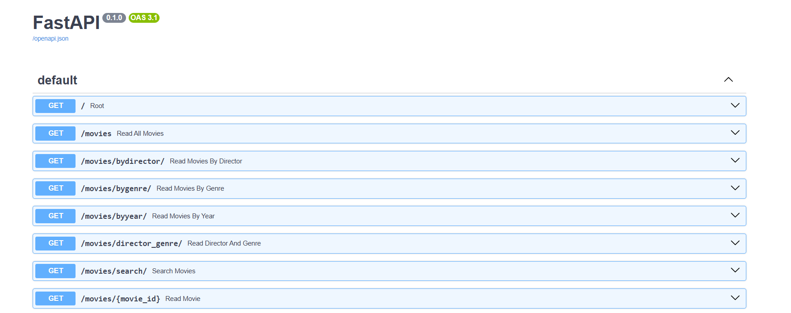
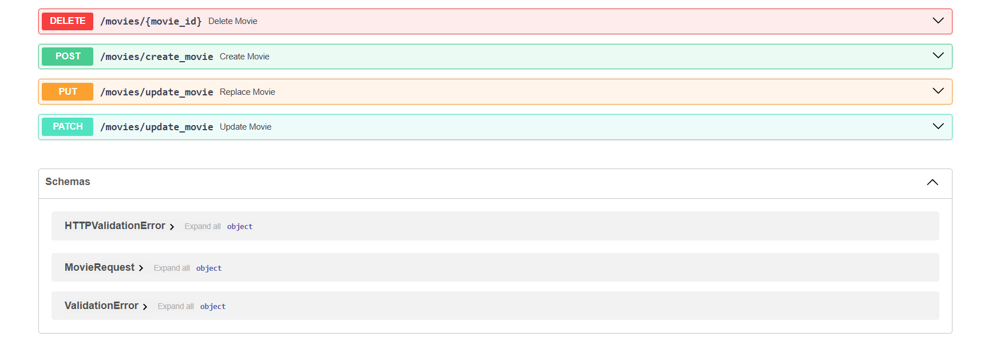

# 🎬 Movie API

A RESTful API built with FastAPI for managing a movie collection. Features complete CRUD operations, advanced filtering, search functionality, proper error handling, and persistent database storage via SQLAlchemy.

## Technologies

- Python 3.8+
- FastAPI
- Uvicorn
- SQLAlchemy
- SQLite (local) / PostgreSQL (production)

## Project Structure
```
MOVIE-API/
├── main.py          ← API routes and logic
├── database.py      ← DB engine, session, and base config
├── models.py        ← SQLAlchemy Movie model
├── requirements.txt
└── .gitignore
```

## 📦 Installation

1. **Clone the repository**
```bash
git clone https://github.com/ChiragO9/Movie-API-.git
cd Movie-API-
```

2. **Create and activate virtual environment**
```bash
# Create virtual environment
python -m venv fastapienv

# Activate on Windows
fastapienv\Scripts\activate

# Activate on Mac/Linux
source fastapienv/bin/activate
```

3. **Install dependencies**
```bash
pip install -r requirements.txt
```

Or manually:
```bash
pip install fastapi uvicorn sqlalchemy psycopg2-binary
```

## Running the API
```bash
uvicorn main:app --reload
```

The API will be available at `http://127.0.0.1:8000`

**Interactive Documentation:** `http://127.0.0.1:8000/docs`

On first startup, the API will automatically:
- Create the `movies.db` SQLite database and the movies table
- Seed it with 9 starter movies (only if the table is empty)

## Screenshots

### Interactive API Documentation



## API Endpoints

### Root
- **`GET /`**
  - Returns welcome message
  - **Response:** `{"message": "Welcome to the Movie API"}`

### Get All Movies
- **`GET /movies`**
  - Returns all movies in the database
  - **Response:** Array of movie objects

### Get Movie by ID
- **`GET /movies/{movie_id}`**
  - Get a specific movie by its ID
  - **Example:** `/movies/1`
  - **Path Param:** `movie_id` must be a positive integer
  - **Response:** Single movie object or 404 error

### Filter by Director
- **`GET /movies/bydirector/?director={name}`**
  - Filter movies by director name (case-insensitive)
  - **Example:** `/movies/bydirector/?director=Christopher Nolan`
  - **Response:** Array of matching movies or 404 error

### Filter by Genre
- **`GET /movies/bygenre/?genre={genre}`**
  - Filter movies by genre (case-insensitive)
  - **Example:** `/movies/bygenre/?genre=sci-fi`
  - **Response:** Array of matching movies or 404 error

### Filter by Year
- **`GET /movies/byyear/?year={year}`**
  - Filter movies by release year (valid range: 1888–2030)
  - **Example:** `/movies/byyear/?year=2010`
  - **Response:** Array of matching movies or 404 error

### Filter by Director AND Genre
- **`GET /movies/director_genre/?director={name}&genre={genre}`**
  - Filter movies by both director and genre (case-insensitive)
  - **Example:** `/movies/director_genre/?director=Christopher Nolan&genre=sci-fi`
  - **Response:** Array of matching movies or 404 error

### Search Movies
- **`GET /movies/search/?q={query}`**
  - Search across title, director, and genre (case-insensitive)
  - **Example:** `/movies/search/?q=nolan`
  - **Response:** Array of matching movies or 404 error

### Create Movie
- **`POST /movies/create_movie`**
  - Add a new movie to the database (ID is auto-assigned)
  - **Request Body:**
```json
{
  "title": "Movie Title",
  "director": "Director Name",
  "genre": "Genre",
  "year": 2024
}
```
  - **Response:** `201 Created` with the new movie object (including its assigned `id`)
  - **Validation:**
    - `title` and `director`: 1–100 characters
    - `genre`: 1–50 characters
    - `year`: between 1888 and 2030
    - Movie title must be unique (400 error if duplicate)

### Replace Movie (Full Update)
- **`PUT /movies/update_movie`**
  - Fully replace an existing movie by ID
  - **Request Body:** Same as Create, but `id` is required
```json
{
  "id": 1,
  "title": "Updated Title",
  "director": "Updated Director",
  "genre": "Updated Genre",
  "year": 2024
}
```
  - **Response:** `204 No Content` or 404 error

### Update Movie (Partial Update)
- **`PATCH /movies/update_movie`**
  - Partially update an existing movie — only provided fields are changed
  - **Request Body:** `id` is required, all other fields are optional
```json
{
  "id": 1,
  "genre": "thriller"
}
```
  - **Response:** `204 No Content` or 404 error

### Delete Movie
- **`DELETE /movies/{movie_id}`**
  - Delete a movie by its ID
  - **Example:** `/movies/3`
  - **Path Param:** `movie_id` must be a positive integer
  - **Response:** `204 No Content` or 404 error

## Response Format

All endpoints return JSON. Movie objects contain:
- `id` (integer) — Auto-assigned unique identifier
- `title` (string) — Movie title
- `director` (string) — Director name
- `genre` (string) — Movie genre
- `year` (integer) — Release year

**Example Movie Object:**
```json
{
  "id": 1,
  "title": "Inception",
  "director": "Christopher Nolan",
  "genre": "sci-fi",
  "year": 2010
}
```

## Error Responses

- **404 Not Found** — No movies match the query or movie doesn't exist
- **400 Bad Request** — Missing required fields, duplicate movie title, or invalid input
- **422 Unprocessable Entity** — Request body fails validation constraints

**Error Response Format:**
```json
{
  "detail": "Error message describing the issue"
}
```

## Sample Movie Database

The API auto-seeds with 9 movies on first run:

| # | Title | Director | Genre | Year |
|---|-------|----------|-------|------|
| 1 | Inception | Christopher Nolan | sci-fi | 2010 |
| 2 | The Dark Knight | Christopher Nolan | action | 2008 |
| 3 | Interstellar | Christopher Nolan | sci-fi | 2014 |
| 4 | Titanic | James Cameron | romance | 1997 |
| 5 | Forrest Gump | Robert Zemeckis | drama | 1994 |
| 6 | Gladiator | Ridley Scott | historical | 2000 |
| 7 | The Godfather | Francis Ford Coppola | crime | 1972 |
| 8 | Parasite | Bong Joon-ho | thriller | 2019 |
| 9 | La La Land | Damien Chazelle | musical | 2016 |

## Author

**Chirag**
- GitHub: [@ChiragO9](https://github.com/ChiragO9)

---

> **Data persistence:** Movie data is stored in a SQLite database locally (`movies.db`) and persists across server restarts. In production, a PostgreSQL database is used via the `DATABASE_URL` environment variable.
